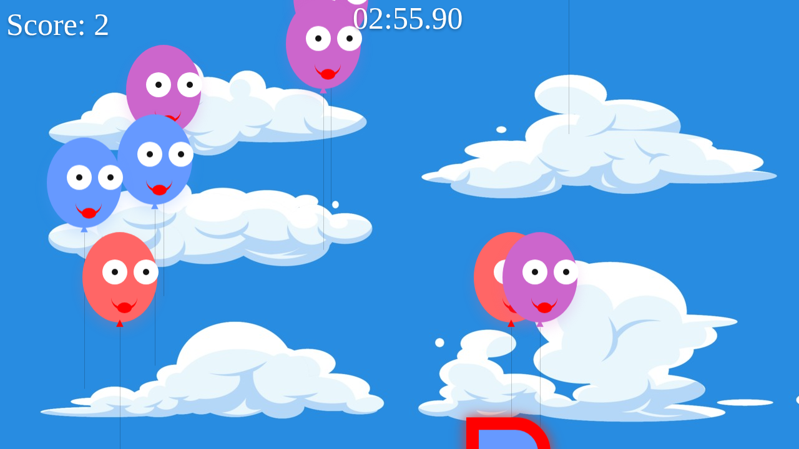
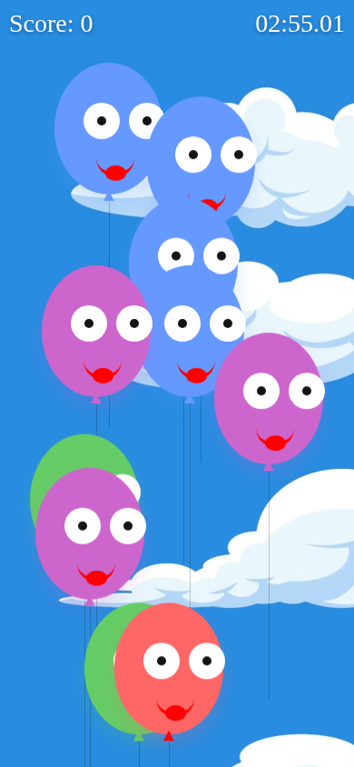

# 🎈 Balloon Pop

A cheerful balloon-popping game for kids. Smiling balloons float up through a sky full of clouds, and you pop as many as you can before the clock runs out. It runs in any modern browser on desktop, tablet or phone, and ships as an Android app too.

### ▶️ [Play it now in your browser](https://codejq.github.io/BalloonPop/)



## How to play

1. Press **Start**.
2. Pop balloons by **hovering over, clicking or tapping** them.
3. Watch out for the special balloons:

| Balloon | Effect |
|---|---|
| 🎈 Smiling balloon (red, blue, green, yellow, purple) | **+1** point |
| 💚 Green heart balloon (rare) | **+1** point and a dino roar |
| 😈 Evil balloon (red spiky outline) | **−10** points |

- **Win:** reach **150 points** before the 3-minute timer runs out and the confetti falls 🎉
- **Lose:** the timer hits zero, or your score drops below **−100**.

## Screenshots

| Start screen | Mobile |
|---|---|
|  |  |

## 🤖 Let AI agents play

LLM agents (Claude computer use, browser-use, Playwright MCP, and others) can play Balloon Pop. The instructions for agents live at [`/llms.txt`](https://codejq.github.io/BalloonPop/llms.txt).

**JavaScript API.** Run these in the page from any browser tool that can evaluate JS:

```js
BalloonPop.help();                 // API summary
BalloonPop.start({ speed: 0.5 });  // start; speed < 1 slows the balloons for slower agents
BalloonPop.getState();             // { status, score, timeLeft, balloons: [{ id, type, shouldPop, x, y, visible }] }
BalloonPop.pop('balloon-7');       // pop one balloon -> { ok, type, points, score }
BalloonPop.popAllSafe();           // pop every visible balloon that isn't evil
```

**DOM and accessibility tree.** Every balloon is `role="button"` with a unique `id`, a `data-type` (`normal` / `heart` / `evil`) and an `aria-label` such as *"Pop red balloon (+1 point)"* or *"Evil balloon - do NOT pop (-10 points)"*, so agents that click on screen can tell balloons apart.

**Slow mode.** Open [`?speed=0.2`](https://codejq.github.io/BalloonPop/?speed=0.2) to slow the balloons down for agents that take a few seconds per action.

## Run it locally

The web game is plain HTML, CSS and JavaScript with no build step and no dependencies:

```bash
cd BalloonPop/src/main/assets/www
python3 -m http.server 8000
# open http://localhost:8000
```

## Project structure

```
BalloonPop/
├── BalloonPop/                      # Android app module (WebView wrapper)
│   └── src/main/
│       ├── java/com/piisoft/balloonpop/ui/Home.java   # loads the web game
│       └── assets/www/              # ← the web game itself
│           ├── index.html
│           ├── app.js               # game loop, scoring, timer, explosions
│           ├── agent-api.js         # window.BalloonPop API for AI agents
│           ├── llms.txt             # instructions for AI agents
│           ├── celebrate.js         # confetti on win
│           ├── style.css / celebrate.css
│           └── assets/              # background, sounds
├── switchCompatLibrary/             # Android support library
├── .github/workflows/pages.yml      # GitHub Pages deployment
└── docs/screenshots/
```

## Deployment (GitHub Pages)

On every push to `master` that touches the web game, [`.github/workflows/pages.yml`](.github/workflows/pages.yml) copies just the files the game needs and publishes them to the `gh-pages` branch. You can also run it by hand from the **Actions** tab.

One-time setup: in **Settings → Pages**, set **Source** to *Deploy from a branch* and choose **`gh-pages` / `(root)`**.

## Android app

Open the project in Android Studio and run the `BalloonPop` module. The app is a full-screen WebView that loads `file:///android_asset/www/index.html`, so both platforms share the same game code.
