# 🎈 Balloon Pop

A cheerful balloon-popping game for kids that teaches **colors, shapes, numbers and letters** in **11 languages**. It runs in any modern browser on phones, tablets and desktops, in portrait or landscape. It installs as an offline app and also ships as an Android app.

### ▶️ [Play it now in your browser](https://codejq.github.io/BalloonPop/)

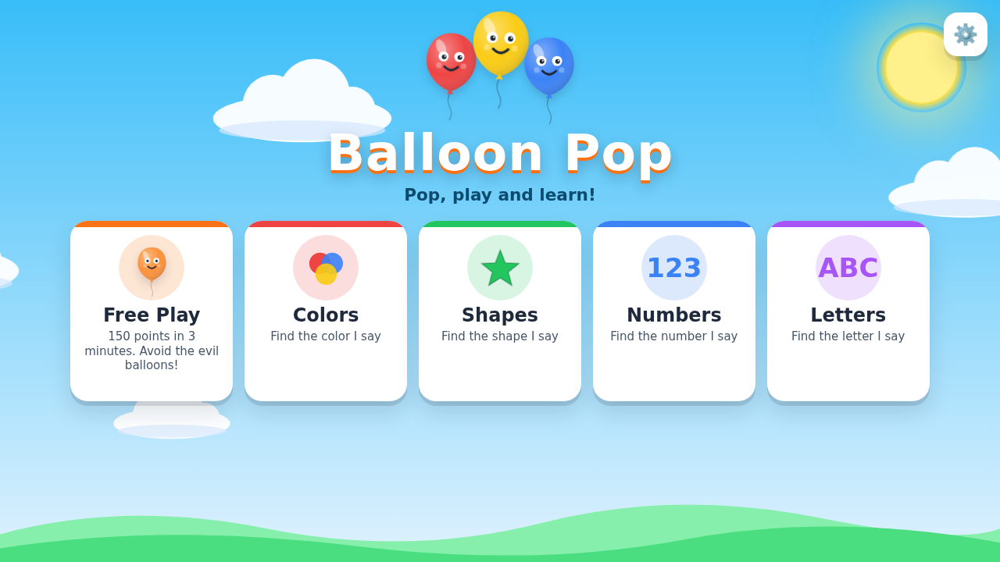

## Install it on your phone

Balloon Pop installs like an app, with its own icon, full screen and offline play. On phones and tablets a popup offers it a moment after the game opens:

- **Install**: on Android (Chrome, Edge, Samsung Internet) this opens the phone's install prompt. On iPhone and iPad it shows the steps: tap **Share**, choose **Add to Home Screen**, then **Add**.
- **Later**: asks again in 3 days.
- **No thanks**: never asks again.

The popup never interrupts a game, and never appears once the game is installed, in agent mode or in automated browsers. You can always install from **⚙️ Settings → Install app**, and on desktop Chrome or Edge from the install icon in the address bar.

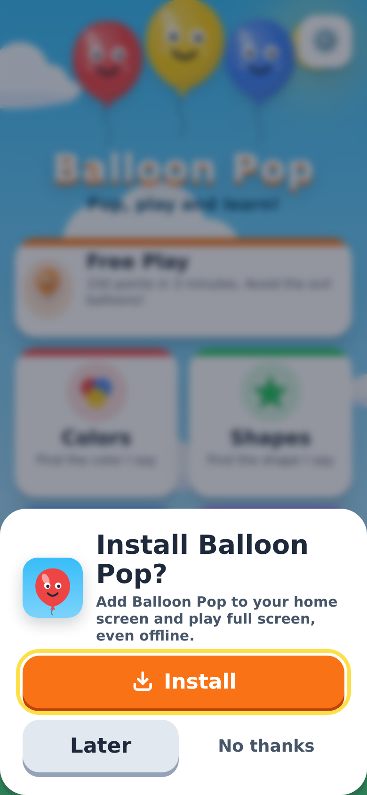

## Game modes

| Mode | How it works |
|---|---|
| 🎈 **Free Play** | Reach **150 points in 3 minutes**. Smiley balloons are **+1**, pink heart balloons **+5**, and angry spiky balloons **−10**. Drop below −100 and you lose. On desktop, hovering the mouse over a balloon pops it, just like the original game. |
| 🔴 **Colors** | A voice says a color ("Find **red**!"). Pop balloons of that color. |
| ⭐ **Shapes** | Find the circle, square, triangle, star, heart, diamond, rectangle or oval. |
| 🔢 **Numbers** | Find numbers from 1 to 20. |
| 🔤 **Letters** | Find letters of the alphabet: Latin, Cyrillic for Russian, Arabic for Arabic. |

**🎓 Learn 1, 2, 3 and Learn ABC** (in Numbers and Letters): pop the numbers from 1 to 20, or the whole alphabet, **in order** while the voice counts or spells along. A strip at the top shows what's done, what's next and what comes after, and for numbers a row of dots shows how many. A wrong balloon wobbles instead of popping and the voice repeats the one to find. Russian and Arabic use their own alphabets.

| Learn 1, 2, 3 | Learn ABC |
|---|---|
| 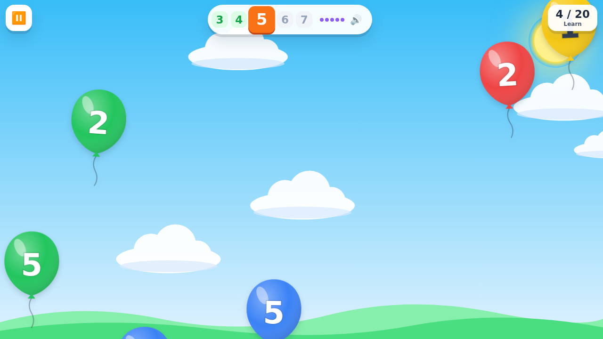 | 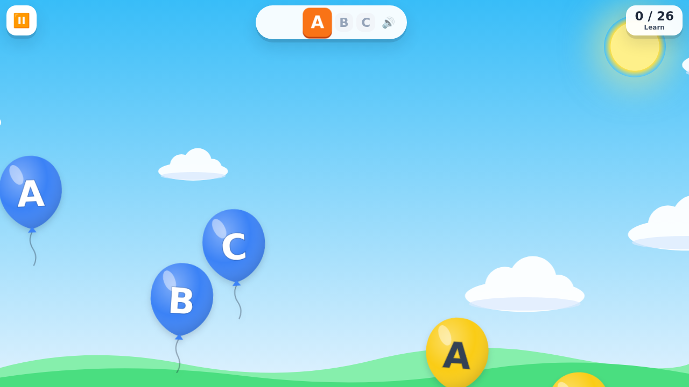 |

**Learning modes** (Colors, Shapes, Numbers, Letters) have:

- **Explore**, a no-pressure mode for toddlers where every pop says the balloon's name.
- **Levels** that get harder: more choices, faster balloons, and a bigger goal (7 to 12 correct pops).
- **Stars:** 3★ for 0–1 misses, 2★ for up to 4 misses, 1★ for more. Finishing a level unlocks the next one. Progress is saved on the device.
- **Gentle feedback:** a wrong pop says what that balloon was and repeats the target, so kids learn from mistakes. The right balloon always appears on screen.
- **Tap the prompt** to hear the word again.

| Colors | Shapes |
|---|---|
| 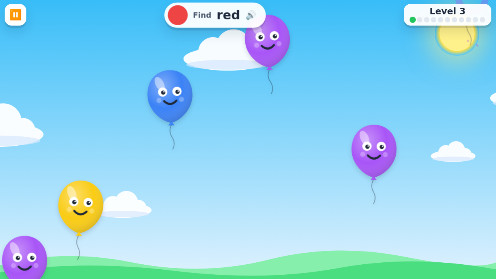 | 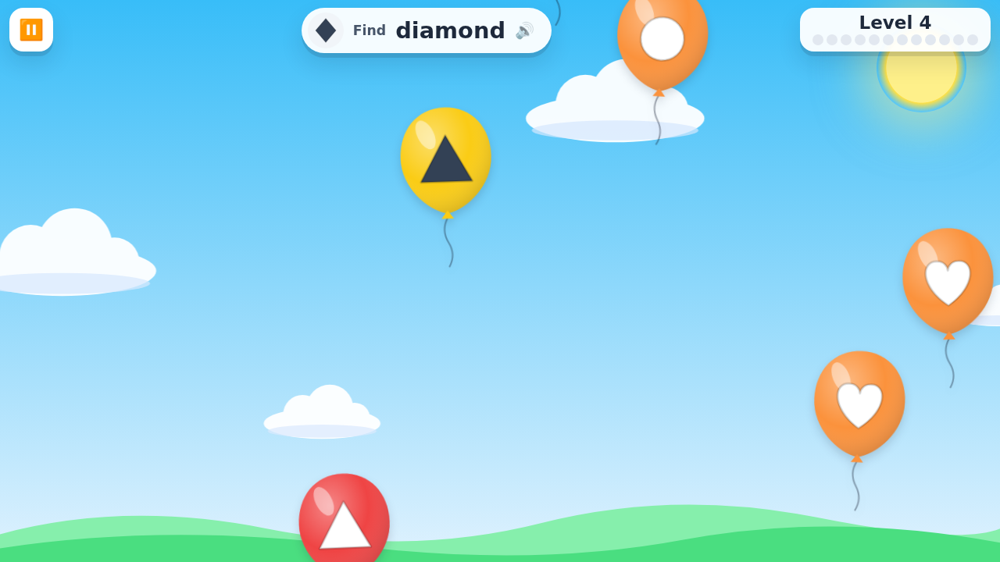 |
| **Free Play** | **Arabic letters (Explore)** |
| 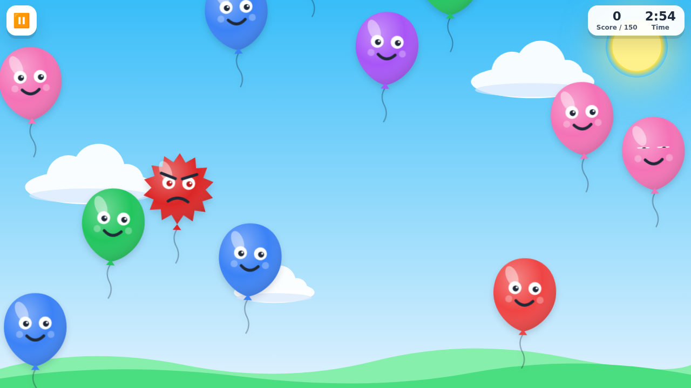 | 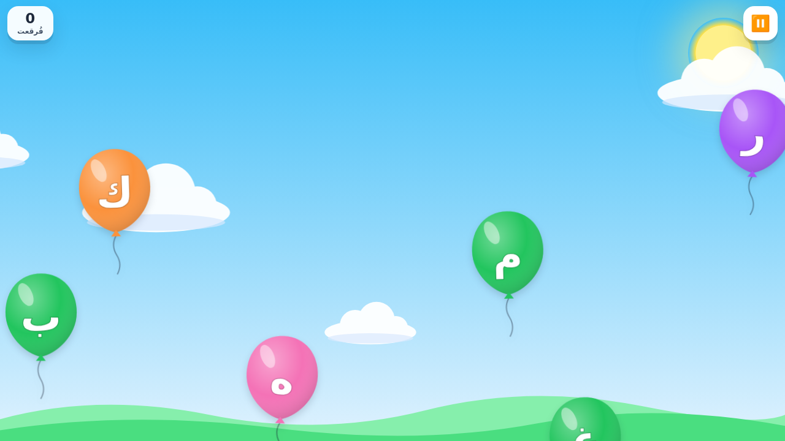 |

## Works on every screen

The layout adapts to the device: two-column cards on phones, a compact row on landscape phones, and roomy grids on tablets and desktops. Balloon size, speed lanes and how many balloons appear at once scale with the screen. It respects notches and safe areas, supports right-to-left languages and reduced-motion settings, and every button is at least 48 px for small fingers.

| Phone | Phone gameplay | Tablet (Spanish) |
|---|---|---|
| 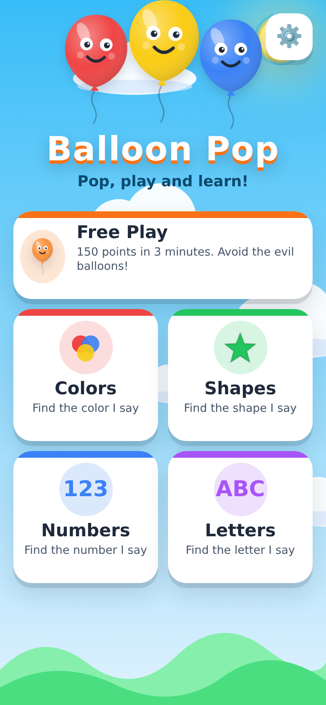 | 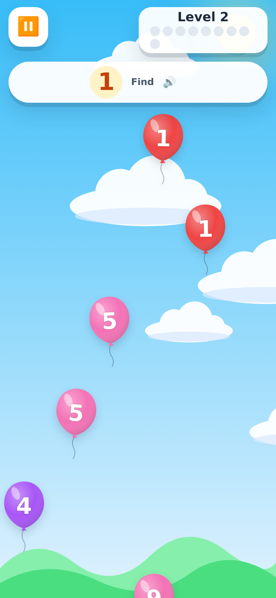 | 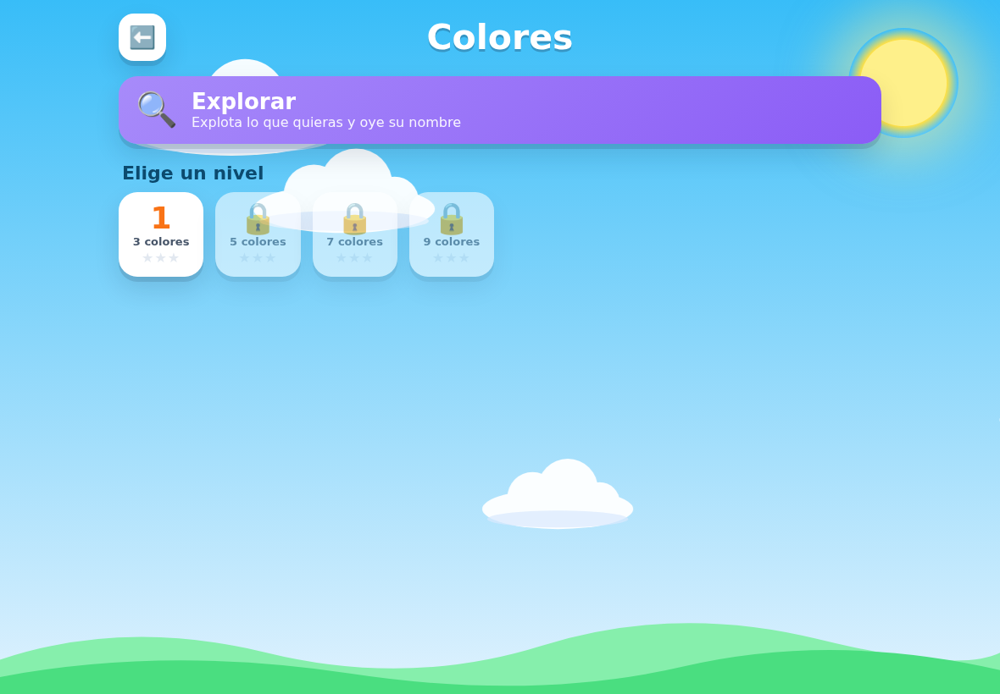 |

## Languages and voices

English, Español, Français, Deutsch, Italiano, Português, Nederlands, Svenska, Русский, Bahasa Indonesia and العربية. The whole interface is translated, and the language is picked automatically from the browser (you can change it in ⚙️ Settings).

**Voices are pre-rendered and cached.** Every spoken word (9 colors, 8 shapes, numbers 1–20, the alphabet and praise phrases) is a small MP3 clip, about 3 MB in total for 9 languages, generated with the open-source [Piper](https://github.com/rhasspy/piper) engine using openly licensed voices ([credits](BalloonPop/src/main/assets/www/voices/CREDITS.md)). Clips are decoded once and kept in memory, and a service worker stores them for offline play, so nothing is rendered again at play time. Indonesian and Arabic have no openly licensed Piper voice, so they use the device's own text-to-speech.

To add words or languages, edit `js/i18n.js` and regenerate the clips:

```bash
pip install piper-tts lameenc
python3 tools/generate_voices.py            # all languages
python3 tools/generate_voices.py --only fr  # just one
```

**Balloon sounds.** The game uses the same three sounds as the original game: popping a balloon plays `sounds/popup.wav`, the heart balloon `sounds/dino.mp3`, and the evil balloon `sounds/evil.wav`. To change a sound, put another file in `www/sounds/` and point [`sounds/sounds.js`](BalloonPop/src/main/assets/www/sounds/sounds.js) at it:

```js
window.CUSTOM_SOUNDS = { pop: 'sounds/popup.wav', heart: 'sounds/dino.mp3', evil: 'sounds/evil.wav' };
```

Remove an entry to fall back to a sound synthesised in code. Files are decoded once and cached offline. All other sound effects are synthesised with the Web Audio API, and all artwork is SVG drawn in code, so apart from the three balloon sounds the game needs no image or sound files.

## 🤖 Let AI agents play

LLM agents (Claude computer use, browser-use, Playwright MCP, WebMCP-enabled browsers and others) can play every mode. Their instructions live at [`/llms.txt`](https://codejq.github.io/BalloonPop/llms.txt).

**Agent mode (turn-based).** Open [`?agent=1`](https://codejq.github.io/BalloonPop/?agent=1). The game **freezes while the agent thinks** and runs for about 1.5 s after each click, tap or API move, so even an agent that takes several seconds per screenshot can play. A badge shows whether the game is waiting or running, and hovering never pops balloons, so moving the mouse over an evil balloon is safe.

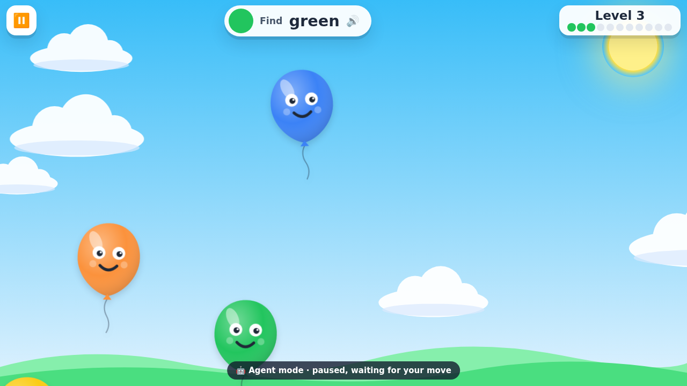

**Ways to play:**

| Agent type | How it plays |
|---|---|
| Screenshot + click (computer use) | Open `?agent=1`, read the prompt ("Find: red"), click the matching balloon, repeat. |
| Accessibility tree / DOM | Balloons are `role="button"` with labels like "red balloon" or "Evil balloon - do NOT pop". |
| WebMCP browsers | The page registers tools on `navigator.modelContext`: `balloonpop_start`, `balloonpop_look`, `balloonpop_pop`, `balloonpop_pop_all_safe`, `balloonpop_wait`. |
| JavaScript (Playwright, browser-use, devtools) | Use the `window.BalloonPop` API below. |

```js
BalloonPop.start({ mode: 'colors', level: 1, agent: true });   // turn-based game
BalloonPop.describe();       // "Find: "red" ... - balloon-7: red balloon at (412, 388)  <- POP"
BalloonPop.pop('balloon-7'); // -> { ok, correct, points, score }
await BalloonPop.step(1500); // let balloons float for 1.5 s
BalloonPop.popAllSafe();     // pop every balloon it's right to pop
BalloonPop.start({ mode: 'numbers', learn: true, agent: true });   // Learn 1, 2, 3
```

Deep links: `?agent=1&mode=shapes&level=2`, `?mode=letters&explore=1`, `?mode=numbers&learn=1`, `?lang=fr`, `?speed=0.3`, `?step=2500`.

## Run it locally

Plain HTML, CSS and JavaScript with no build step:

```bash
cd BalloonPop/src/main/assets/www
python3 -m http.server 8000
# open http://localhost:8000
```

## Project structure

```
BalloonPop/src/main/assets/www/      # the web game (also bundled in the Android app)
├── index.html
├── css/game.css                     # responsive layout and animations
├── js/i18n.js                       # words and UI text for 11 languages
├── js/audio.js                      # cached voice clips, TTS fallback, synthesised sound effects
├── js/art.js                        # SVG balloons, shapes and clouds
├── js/game.js                       # modes, levels, spawning, scoring, screens
├── agent-api.js / llms.txt          # API and instructions for AI agents
├── sw.js / manifest.webmanifest     # offline support, installable app
├── js/install.js / icons/           # Install button, iOS instructions, app icons
├── sounds/                          # balloon sounds + sounds.js config
└── voices/<lang>/…mp3               # pre-rendered voice clips
tools/generate_voices.py             # regenerates voice clips with Piper
.github/workflows/pages.yml          # GitHub Pages deployment
BalloonPop/src/main/java/…/Home.java # Android WebView wrapper (+ native TTS bridge)
```

## Deployment (GitHub Pages)

On every push to `master` that touches the web game, [`.github/workflows/pages.yml`](.github/workflows/pages.yml) publishes `www/` to the `gh-pages` branch. It leaves out the legacy `www/assets/` folder, which the game no longer uses. You can also run it by hand from the **Actions** tab. GitHub Pages must be set to serve from the `gh-pages` branch (**Settings → Pages**).

## Android app

Open the project in Android Studio and run the `BalloonPop` module. The app is a full-screen WebView that loads the same web game. It plays the bundled voice clips and uses Android's TextToSpeech for languages without clips. It now rotates freely instead of being locked to landscape.
